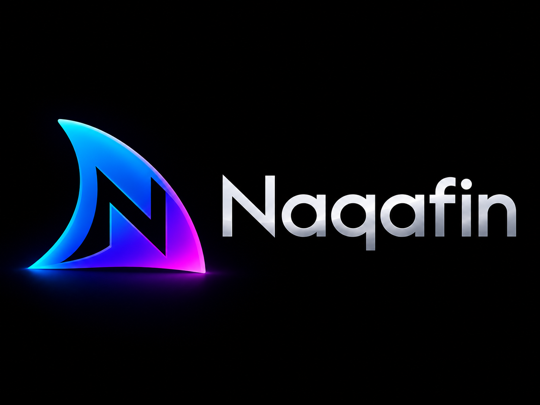

<p align="center"></p>

# Naqafin for Roku

Naqafin is an independent, unofficial Roku client for Jellyfin-compatible media servers.

This project is forked from [Jellyfin Roku](https://github.com/jellyfin/jellyfin-roku), but it is not affiliated with, endorsed by, sponsored by, or officially supported by the Jellyfin project or Roku.

Naqafin does not provide media content. It connects to a Jellyfin server that you configure.

## Differences From Jellyfin Roku

Naqafin currently includes these changes relative to the upstream Jellyfin Roku project:

- Playlist Up Next support: enriches the existing Continue Watching and Next Up home rows with playlist-aware resume and next-item candidates from configured playlists.
- Server-generated caption playback support: adds the `Auto-Generated` subtitle option when a compatible Jellyfin server plugin is installed.
- Generated-caption controls: adds in-player language selection, optional OpenAI caption polish toggling, and per-video cache clearing when the server plugin advertises support.
- Enhanced subtitle styling: adds Naqafin-rendered text subtitles with selectable size scaling from 50% to 100%.
- In-player Subtitle Tools: adds playback-time controls for enhanced subtitle size, current-video subtitle timing offset, enhanced subtitle background opacity, and generated-caption options while video continues playing.
- Naqafin branding and Roku packaging metadata for independent distribution.

The feature changes are maintained separately from upstream Jellyfin Roku. Broadly reusable client changes can still be proposed upstream as focused pull requests when appropriate.

## Companion Server Plugins

Naqafin's additional Roku features currently depend on companion Jellyfin server plugins:

- [Jellyfin Plugin Playlist Up Next](https://github.com/naqadata/jellyfin-plugin-playlist-up-next): exposes playlist-ordered resume and next-up candidates that Naqafin blends into the existing Continue Watching and Next Up home rows.
- [Jellyfin Plugin Auto Generate Captions](https://github.com/naqadata/jellyfin-plugin-auto-generate-captions): provides the generated-caption session API, live WebVTT endpoint, caption cache controls, and optional OpenAI polish capability used by Naqafin's subtitle UI.

These plugins are designed to work with Naqafin. Stock Jellyfin clients do not currently support these plugin-specific client workflows.

Naqafin hides plugin-backed UI unless the connected server reports the matching plugin as available. On servers without these plugins, the app behaves like the upstream Jellyfin Roku client for those features instead of showing dead controls.

The generated-caption feature is split intentionally: Naqafin starts and displays live generated WebVTT streams, while the Jellyfin plugin owns audio extraction, transcription orchestration, cue splitting, caching, and optional remote-worker fallback.

## Optional Caption Worker

Generated captions can run entirely on the Jellyfin server through the Auto Generate Captions plugin. For better accuracy or throughput on a stronger GPU host, deploy [Naqafin Caption Worker](https://github.com/naqadata/naqafin-caption-worker) and configure the Jellyfin plugin to use it as a remote worker.

Naqafin does not talk to the worker directly. The flow is:

```text
Naqafin Roku -> Jellyfin Auto Generate Captions plugin -> optional Naqafin Caption Worker
```

## Status

Naqafin is independently maintained by Naqadata as a public/free Roku app. It remains an unofficial downstream fork and may differ from the upstream Jellyfin Roku client.

For the upstream Jellyfin Roku project, use:

- Source: <https://github.com/jellyfin/jellyfin-roku>
- Roku Channel Store: <https://channelstore.roku.com/>

## Building

Install dependencies and build the Roku package:

```bash
npm ci
npm run build
```

The build output is written to `out/`.

## Development

Most reusable client development should be kept cleanly separated from Naqafin-only branding and publication changes so it can be compared with, or proposed back to, upstream Jellyfin Roku if useful.

Downstream-only changes should stay in this repo, including:

- Naqafin app name and artwork
- Roku beta/public package settings
- Store listing, policy, and support metadata
- Roku certification and publication compatibility tweaks for Naqafin distribution

## License

Naqafin is distributed under GPL-2.0, matching the upstream Jellyfin Roku project's license. See [LICENSE](LICENSE).

Jellyfin is a trademark of the Jellyfin project. Roku is a trademark of Roku, Inc. This project is unofficial and independent.
